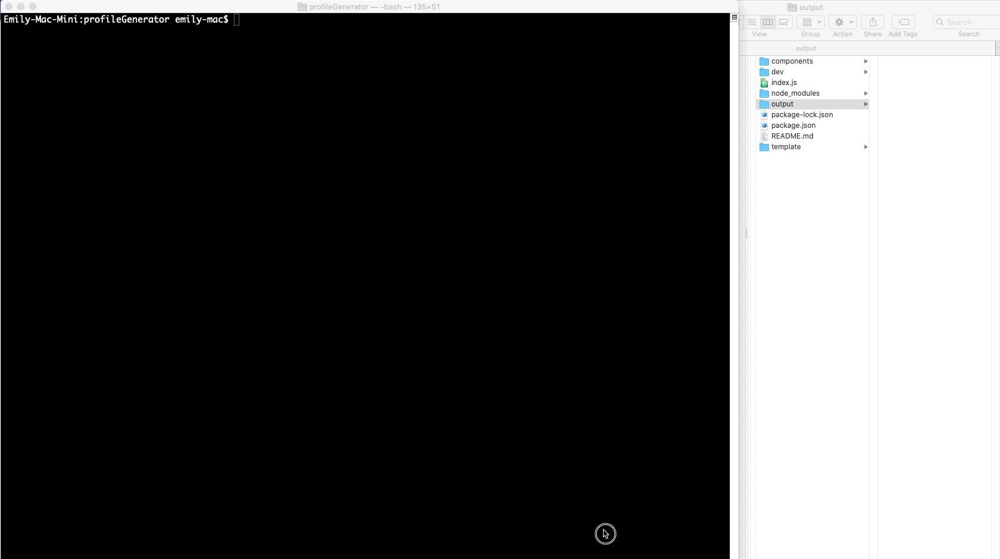

# Github Profile PDF Generator
> A command-line app that generates a Github profile in PDF format from a username

## 🎯 Purpose
Quickly generate a profile by providing a Github username and save it as a document so that you can easily prepare for meetings, reports, stakeholders etc.

## ✔️ How to use
After install all dependencies with `npm install`, run `npm start` or `node index.js`

## 📄 Feature
- Easy to use: only GitHub username and color for background of file are needed.
- Generated PDF file will be saved in 'output' folder(check the example file in the folder).
- PDF file includes the following info:
   - A bio image from the user's GitHub profile.
   - A user's location and a link to their GitHub profile.
   - The number of public repositories, followers, GitHub stars and following count.

## ✨ Demo

